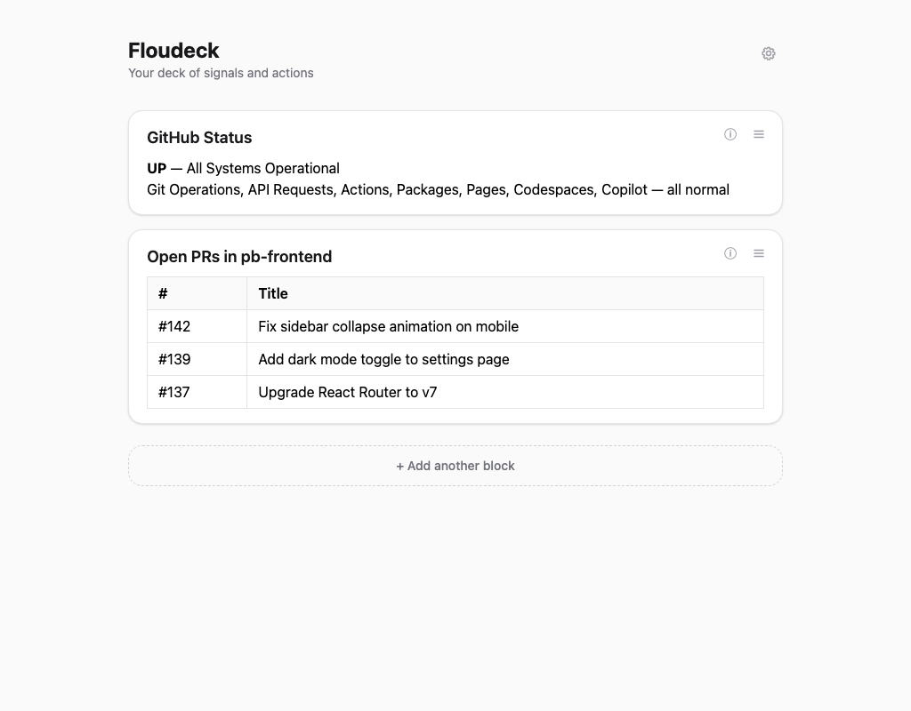

# Floudeck

A local feed of scheduled blocks that run prompts through [Claude Code CLI](https://docs.anthropic.com/en/docs/claude-code) and render the results as GFM markdown.



## Quick start

```bash
bun install
bun run dev        # http://localhost:3000
```

Requires `claude` CLI in your PATH.

## What it does

- Define blocks with a prompt and a repeat interval (minutes/hours/days)
- Each block runs through Claude Code CLI on schedule
- Output is GFM markdown rendered in a card
- SSE pushes updates to the browser in real time
- Blocks can be edited, refreshed, or deleted
- Per-block and global runner configuration (model, timeout, permissions, cwd, env vars)
- Live date/time clock in header with calendar popover on hover
- Tabbed settings modal (Runner defaults, Display preferences)

## Development

```bash
bun run test       # unit tests
bun run e2e        # Playwright E2E tests
bun run check      # lint + unit + E2E
bun run lint       # biome check
bun run format     # biome auto-fix
```

### Updating the README screenshot

When changing app visuals or functionality, regenerate the screenshot:

```bash
bun run scripts/screenshot.ts
```

This starts a temporary server with mock data, captures a screenshot via Playwright, and saves it to `docs/screenshot.png`. Requires `bunx playwright install chromium` first.

## Stack

Bun (server, bundler, SQLite, package manager), minimal React, Tailwind v4, `marked` (client-side markdown rendering). No ORM, no router, no state library, no websockets.
